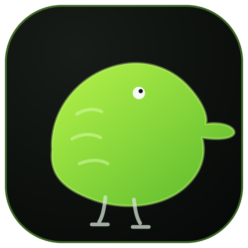

## 📄 __Kiwi__ - Game engine for 2D games

> Note: The engine is still in the development stage




### Requirements

+ Compiler: GCC(MinGW) or Clang with support of C++23
+ CMake >= 3.5
+ Operation System: Windows 10/11
___

### Getting started

#### 1) Clone the repository

```shell
git clone git@github.com:qulop/Kiwi2D.git --recursive 
```

If you cloned the repository without using the `--recursive` flag, you can update all the required submodules using 
the following command:
```shell
git submodule update --init
```

#### 2) Build

If you're using CLion, you need to create at least one CMake build profile using either the GCC (MinGW) or Clang compiler.
Then, run the CMake configuration and start building.

In other case, you can build the project through the command line:
```shell
mkdir build; cd build
cmake .. -G "MinGW Makefiles"
cmake --build . --target KiwiEngine --config Release --parallel 
```
___

